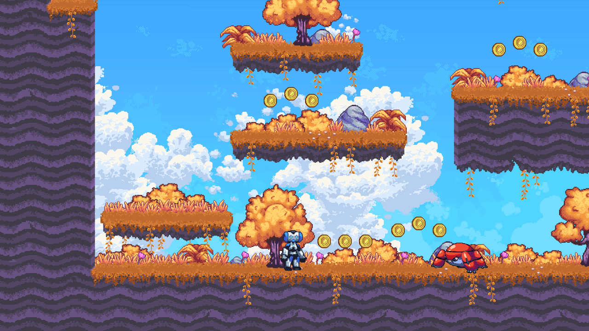

# 2D Platformer (simplified)

This project is a pixel art **Godot 4** 2D platformer based on the [official demo](https://godotengine.org/asset-library/asset/120), trimmed to **platforming only**: no shooting, no enemies, and no collectible coins.

It demonstrates a side-scrolling player with physics, moving platforms, camera limits, pause UI, and optional split-screen. The level adds **seeds**, **soils**, **growth placeholders** with level time-direction behavior (**right grows / left rewinds until maturity lock**), **trash** pickups and a **trash can**, **per-player score** with floating **`+points`** toasts, **soil** feedback when the wrong seed family is used, a **parallax sun** behind clouds (`level/props/Sun.png`), **Feena** end-of-level talk (**`level/feena_goal.gd`**) with **level complete** and **world map** flows, and HUD text styled with the pause menu font — all summarized below and **fully documented in [CHANGELOG.md](CHANGELOG.md)** (including a [documentation map](CHANGELOG.md#documentation-map) and section index).

**Main scene:** `game_singleplayer.tscn` (see `project.godot` → Application → Run).

**Single-player start:** player spawn **`(-170, 546)`** under **`Level`**; horizontal camera bounds are set in **`level/level.gd`** (**`LIMIT_LEFT` −1200**, **`LIMIT_RIGHT` 2200**) so the **`Camera2D`** can follow the full width of the map. See [CHANGELOG — Single-player spawn and camera scroll limits](CHANGELOG.md#single-player-spawn-and-camera-scroll-limits).

**Level content:** `level/level.tscn` (tilemap, props, moving platforms, pickups, soils, trash, two **`TrashCan`** instances with **`Trashcan.png`** art, **seven** **`Trash`** pickups with prop art, animated **`FinishLine`** marker using **`level/props/Feena/idle/`** frames — **`feena_goal.gd`** shows **“Talk to Feena”** within **40px** and uses **`drop_seed*`** to open the **level complete** overlay — and **`Grass/Vine*`** décor using **`Vine1.png`** — climb targets for the player). **Optional second scene:** `level/level_2.tscn` (duplicate layout; not loaded by default — see [CHANGELOG — Level and tileset revisions](CHANGELOG.md#level-and-tileset-revisions-editor)). **Level script:** `level/level.gd` (**`class_name GameLevel`**: camera limits, **`game_level`** group, **`vine_climb`** registration for **`Grass/Vine*`**, level time-direction signal (`time_direction_changed`), willow-seed-2 drop helper, platform visibility→collision gating, **`level_display_name`**, optional **`next_level_scene`**, and **`get_max_achievable_points()`** for the end screen).

Language: **GDScript**  
Renderer: **Compatibility** (`gl_compatibility`)

## Features

- **Player** (`CharacterBody2D`): walk, jump, double-jump, slope snapping, camera with level limits; **`z_index`** tuned so the character draws above the trash can and tilemap (see **Technical notes → 2D draw order** in [CHANGELOG.md](CHANGELOG.md)). **Vine climb** on **`Grass/Vine*`** after jumping onto them (**`move_up` / `move_down`** + jump rules); see [Grass/Vine climb, trash can art, and inputs (2026-04-19)](CHANGELOG.md#grassvine-climb-trash-can-art-and-inputs-2026-04-19).
- **Moving platforms** and static collision from the tilemap; hidden platforms in `level` are non-collidable at runtime.
- **Input:** keyboard, gamepad, and on-screen touch buttons (move / jump / **`move_up`** / **`move_down`** for climb and menus). **Interact / plant / pick up / drop trash:** **`drop_seed`** (and **`drop_seed_p1`** / **`drop_seed_p2`** in split-screen) — table under *Seeds, soils… → Input* in [CHANGELOG.md](CHANGELOG.md).
- **Pause** menu (single-player and split-screen variants); **Label** / **Button** text uses **`gui/theme.tres`** (Kenney font + black outline).
- **Level complete** (`gui/level_complete_screen.*`): after talking to **Feena** (**`level/feena_goal.gd`** on **`FinishLine`**), shows level name, **earned / max** points, **Retry** / **Continue** / **Back to Map**; **`Continue`** loads **`GameLevel.next_level_scene`** if set, else **`gui/world_map.tscn`**. **`gui/world_map.*`** is a small hub (Level 1, split-screen, Quit). See [CHANGELOG — Level complete screen, world map, and Feena goal (2026-04-27)](CHANGELOG.md#level-complete-screen-world-map-and-feena-goal-2026-04-27).
- **Seeds & soils:** **manual** pickup (overlap + **`drop_seed*`**), single carry, plant on matching soil (either willow seed on either willow soil; cypress on cypress). **Wrong family** (cypress on willow patch or willow on cypress) shows a short **`try a different seed`** toast on **`drop_seed*`**; there is no standing “plant here” label. Successful plants grant **score** immediately (see [Score HUD, world points popups…](CHANGELOG.md#score-hud-world-points-popups-soil-feedback-and-sun-overlay-2026-04-19)). After planting, growth follows level time direction (**right = grow, left = reverse, idle = pause**) until maturity; once fully mature, willow/cypress trees stay adult and do not rewind. Growth tuning is currently **75% faster** than the original baseline. **Willow seed 2** is hidden until the first **willow #1** plant reaches maturity on **either** willow soil, then it **falls** near that patch.
- **Trash:** seven **sprite** trash pickups in the main level (textures under **`level/props/Trash/`**); **two trash cans** (`pickups/trash_can.tscn`) accept deposits with the same **`drop_seed*`** action; each deposit adds **score** and a **`+5 points`** toast. Per-can **`pieces_required`** (e.g. **4** + **3** in **`level.tscn`**) completes each can without deleting unpicked trash in the world — [CHANGELOG — Trash and trash can](CHANGELOG.md#trash-and-trash-can), [Trash art / carry / music / vines (2026-04-19)](CHANGELOG.md#trash-art-carry-scale-memphis-loop-and-decor-vines-2026-04-19), and [Level and tileset revisions](CHANGELOG.md#level-and-tileset-revisions-editor).
- **Score HUD & sun:** top-of-screen **points** labels (`gui/score_hud.*`); **sun** in **`parallax_background.tscn`** (`SunBehindClouds` / `sun_parallax_layer.gd`) **behind** cloud layers, **vertical center in the top third** of the view / **40 px** past the player’s screen **x** (from their “y-axis” line) — [Score HUD, world points popups…](CHANGELOG.md#score-hud-world-points-popups-soil-feedback-and-sun-overlay-2026-04-19).
- **Pickup notifications** bottom banner (`PickupNotifications` autoload + `gui/pickup_notifications.gd`).
- Pixel art, sound effects, and background music (**`music.tscn`** autoload + **`music.gd`**: **Memphis** loops and keeps playing when the game is paused).

## Documentation

| Need | Read |
|------|------|
| Overview + this list | **README.md** (this file) |
| Level complete UI, world map, Feena interact, **`GameLevel`** scoring exports | [CHANGELOG — Level complete screen, world map, and Feena goal (2026-04-27)](CHANGELOG.md#level-complete-screen-world-map-and-feena-goal-2026-04-27) |
| Every design choice, file roles, verify steps, **`z_index`**, tween gotchas, score / popups / sun ([**file list**](CHANGELOG.md#files-touched-score-popups-soil-sun)), level complete + Feena ([**files touched**](CHANGELOG.md#files-touched-paths)) | **[CHANGELOG.md](CHANGELOG.md)** |
| Key bindings, autoload list | **`project.godot`** |

## What was removed

A full file-by-file list is in [**CHANGELOG.md**](CHANGELOG.md). In short:

- Gun, bullets, and all `shoot` / `shoot_p1` / `shoot_p2` input actions.
- Enemy scenes, scripts, and level placements.
- Coins, coin pickup scene/script, HUD counter, and `coin_collected` wiring.

## Screenshots

## Music

In-game background track: **Memphis** (`memphis.ogg`, **`Music`** autoload). See [CHANGELOG — Lawrence hero, Memphis pass, and music](CHANGELOG.md#lawrence-hero-memphis-pass-and-music-2026-04-18) and [Trash art / carry / music / vines (2026-04-19)](CHANGELOG.md#trash-art-carry-scale-memphis-loop-and-decor-vines-2026-04-19).

[*Pompy*](https://soundcloud.com/madbr/pompy) by Hubert Lamontagne (madbr) (historical reference from the upstream demo README.)
